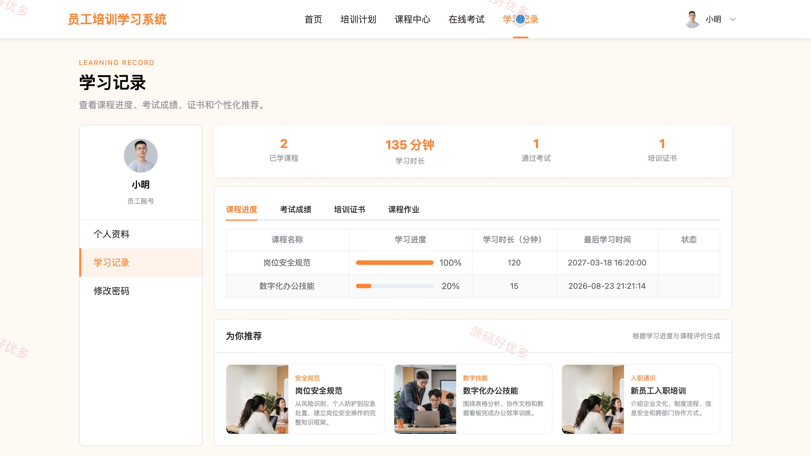
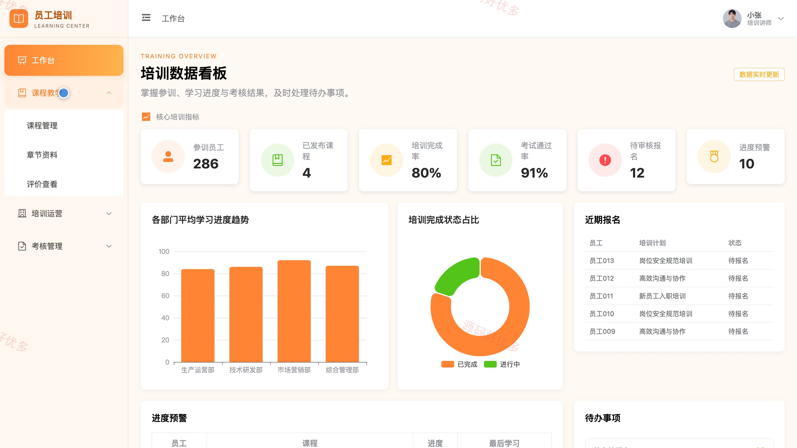
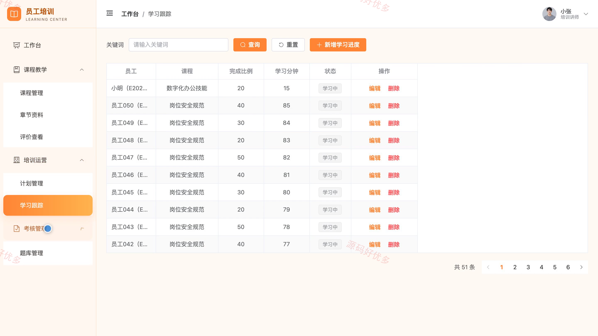
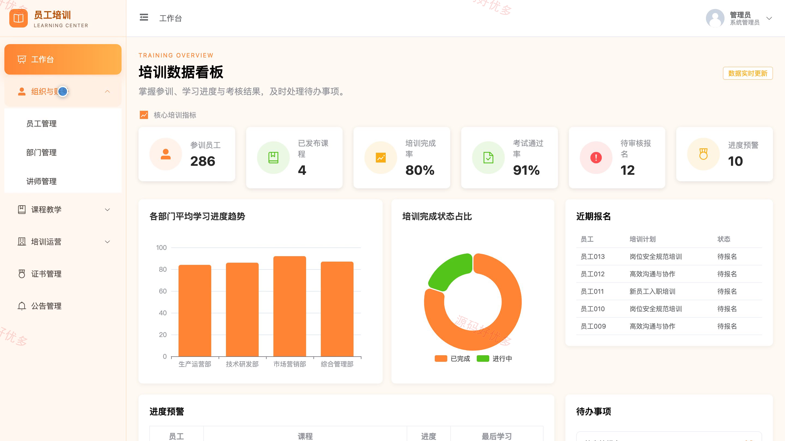
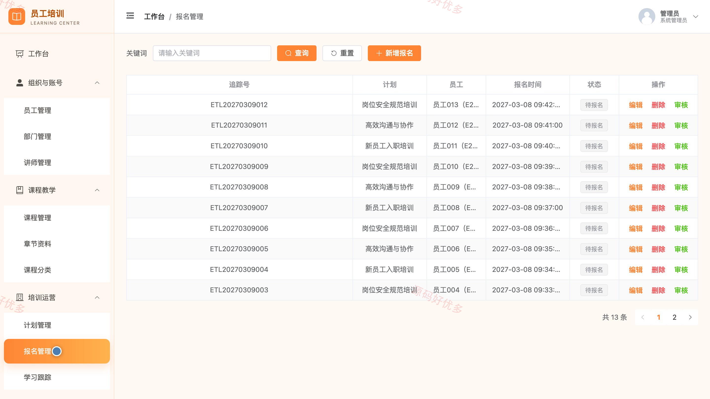

# bs058A
bs058A员工培训学习系统
## 源码问题查看主页咨询

### 一、关键词
员工培训、企业学习平台、在线课程、培训考试、学习进度

### 二、作品包含
源码+数据库+全套环境和工具资源+本地部署教程

### 三、项目技术
前端技术： Html、Css、Js、Vue3.4、Element-Plus
后端技术：Java、SpringBoot3.2.0、MyBatis-Plus

### 四、运行环境（以下版本亲测，其他版本兼容性请自行测试）
开发工具：IDEA/eclipse + VSCODE

数据库：MySQL5.7+（共20张表）

数据库管理工具：Navicat10以上版本

环境配置软件： JDK17 + Maven

前端Nodejs：20

浏览器：谷歌浏览器

### 五、项目介绍
项目编号：bs058A

员工培训学习系统面向员工、培训讲师和系统管理员，围绕培训计划报名、课程学习、在线考试、作业批阅、证书发放与培训统计构建完整学习管理闭环。

角色：员工、培训讲师、系统管理员

员工功能：培训计划查看与报名、课程章节学习、学习进度查看、在线考试与成绩查看、作业提交与评语查看、培训证书查询、课程评价、个性课程推荐。

培训讲师功能：课程与章节资料管理、题库与考试管理、作业批阅、学员答疑、学习进度跟踪、课程评价查看。

系统管理员功能：组织与账号管理、课程与分类管理、培训计划与报名审核、培训证书发放、公告管理、培训数据统计、学习进度预警。

### 六、运行截图

